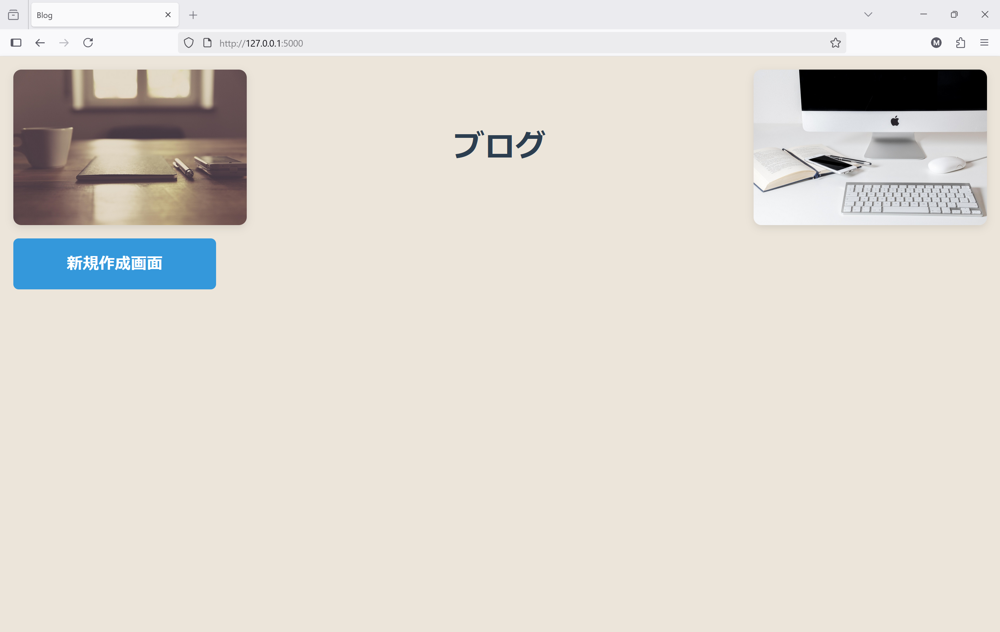
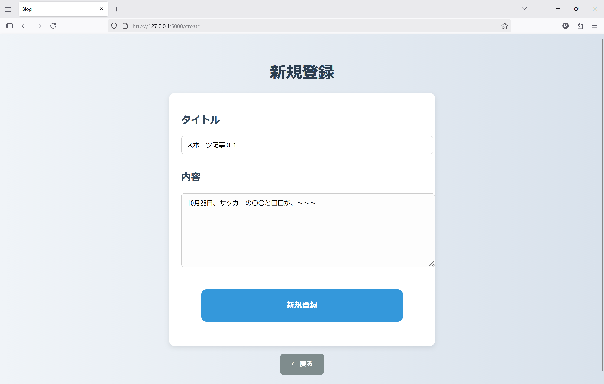
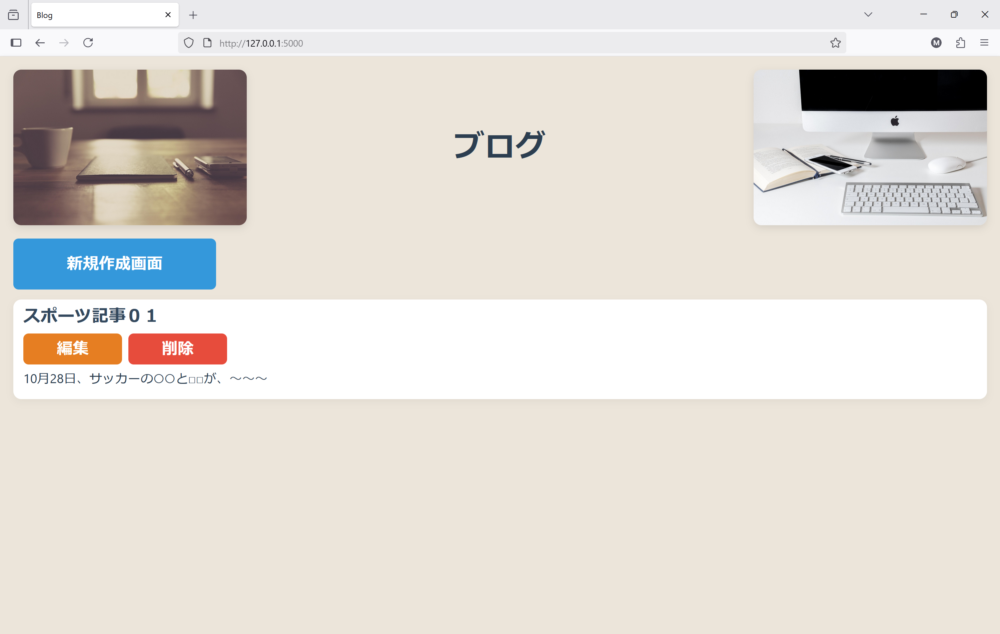
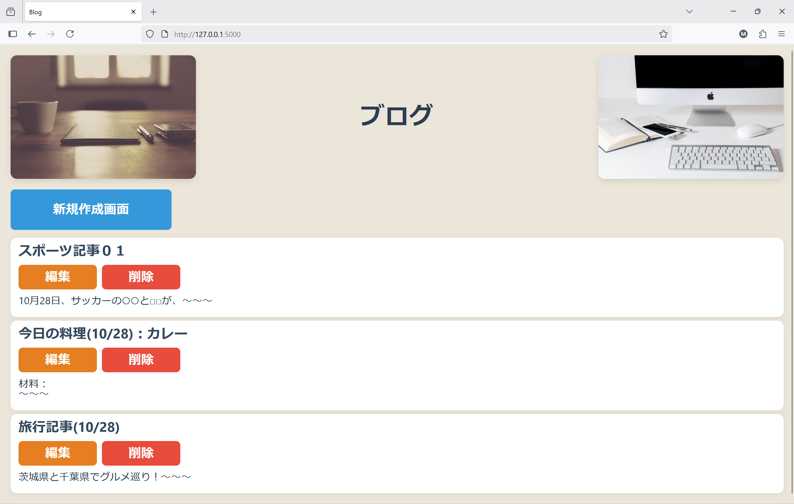
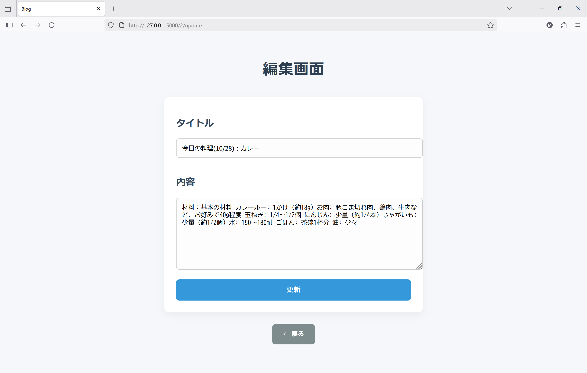

# 📝 Flask投稿アプリ

Flaskフレームワークを使って構築した、シンプルかつ拡張性のある投稿アプリです。 トップページにはPixabayの画像を表示し、投稿の作成・編集・削除といった基本機能を備えています。 今後はカテゴリー分けやバリデーションなど、実用性を高める機能も追加予定です。

## 📸 アプリの画面構成

### 🏠 トップページ（ブログ一覧）

最初に表示されるのは、Pixabayの画像を背景にしたブログ一覧ページ。 左側には「新規作成画面」ボタンがあり、ユーザーはここから新しい投稿を始められます。 上側には、デスク周りの写真を配置し、落ち着いた雰囲気を演出しています。

### 📝 新規作成画面

「新規作成画面」ボタンを押すと、新規登録ページに遷移します。 ここでは、タイトルと本文を入力して投稿を作成できます。 投稿内容はスポーツ記事など、自由に記述可能。 下部には「戻る」ボタンもあり、ユーザー導線を意識した設計になっています。

### 📄 投稿一覧と操作

投稿が完了すると、トップページに投稿一覧として表示されます。 

※３つ投稿を完了させた場合↓

各投稿には「編集」「削除」ボタンがあり、内容の更新や削除が可能です。
例：
10/28の記事変更の場合

投稿タイトルや本文の一部が表示され、今後は作成日時やカテゴリー分けなどの機能追加も予定されています。

## 🔧 使用技術

    Python 3.x

    Flask：ルーティングやテンプレート処理に使用

    Jinja2：HTMLテンプレートの動的生成

    HTML / CSS：フロントエンドの構築

    SQLite：投稿データの保存に使用（他DBにも対応可能）

    venv（仮想環境）：依存パッケージの管理と環境の分離（※今後導入予定）

    VSCode + PowerShell：開発環境

    Pixabay画像：トップページにURL指定で表示

## ✨ 工夫したポイント

    シンプルで親しみやすいデザイン 　背景にやわらかな色のグラデーションを使い、ボタンにマウスを乗せると色が変わるようにすることで、操作しやすく親しみやすい見た目を意識しました。

    ユーザー導線を意識した「戻る」ボタンの設置 　誤操作や迷子を防ぐため、各ページに戻る導線を用意

    テンプレート継承によるコードの再利用性向上 　base.html をベースに、各ページの共通レイアウトを統一

## 🛠 今後の改善点

    投稿に連番や作成日時を表示して、一覧性を向上

    カテゴリー別ページの作成（例：スポーツ、料理など）

    バリデーション機能の追加（空タイトル送信時のエラーメッセージ表示など）

    投稿内容のスタイル調整（文字サイズ・色のカスタマイズ）

    投稿ボタンに時刻表示を追加して、操作のフィードバックを強化

    404ページなどのエラーハンドリング（未実装）

このアプリは、Flaskの基本構造を理解し、実用的な投稿機能を短時間で構築できる力を示すものです。 今後の拡張を見越した設計になっており、ポートフォリオとしても成長が見える構成を意識しています。
